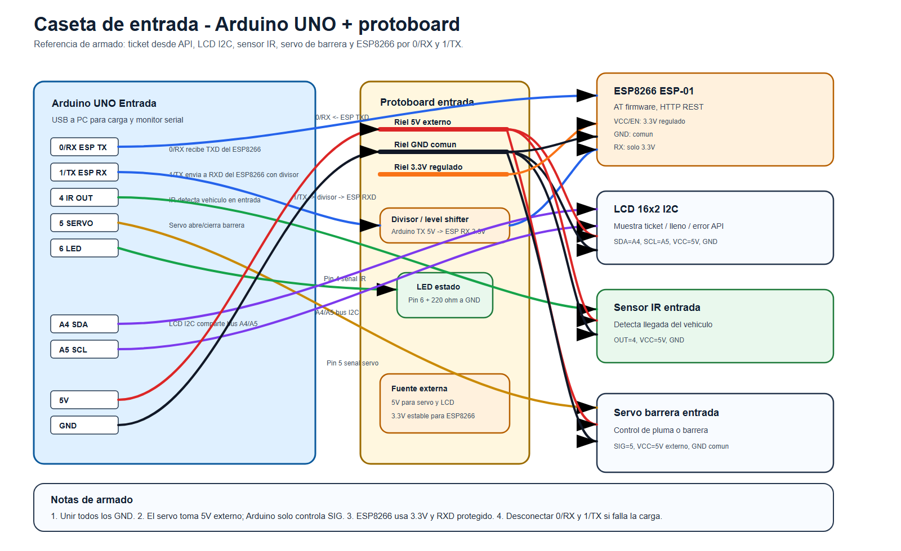
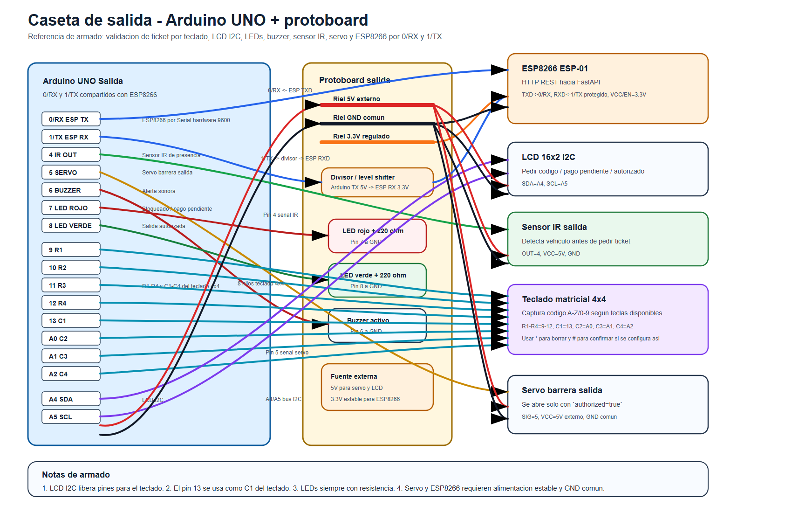

# Plan Arduino SDD

## 1. Proposito

Este documento define la planificacion del firmware y del armado fisico de las
dos casetas Arduino del MVP del sistema de estacionamiento inteligente.

SDD aqui significa Specification Driven Development: primero se fija el
contrato, el flujo, los pines, las pruebas y el despliegue; despues se
implementa el firmware contra esa especificacion.

El sistema usara dos Arduino UNO:

- `Entrada`: detecta vehiculo, solicita ticket a FastAPI, muestra el codigo y
  abre la barrera de entrada.
- `Salida`: detecta vehiculo, captura el codigo por teclado, consulta FastAPI,
  autoriza o bloquea la salida y abre la barrera cuando corresponde.

## 2. Contexto usado

La planificacion parte de:

- `docs/especificacion-sistema-estacionamiento.md`.
- `docs/plan-backend-fastapi-sdd.md`.
- `docs/planificacion-frontend-sdd.md`.
- Capturas en `docs/caps/` sobre entrada, salida, pago y arquitectura.
- Proyectos PlatformIO actuales en `Entrada/` y `Salida/`.

Decisiones heredadas:

- No se usan placas ni camara.
- El codigo de ticket es el identificador operativo.
- FastAPI es la fuente de verdad para capacidad, pago, salida y auditoria.
- Supabase PostgreSQL guarda tickets, pagos, estado y auditoria.
- Stripe queda simulado en esta fase.
- Los Arduinos se comunican con FastAPI por HTTP mediante ESP8266.

## 3. Supuestos de hardware

Para que ambos circuitos quepan en Arduino UNO, esta planificacion asume:

| Cantidad | Componente | Uso |
| --- | --- | --- |
| 2 | Arduino UNO | Controladores principales, uno por caseta. |
| 2 | Protoboard | Una por caseta, recomendado para separar entrada y salida. |
| 2 | Modulo ESP8266 ESP-01 o equivalente | WiFi con AT firmware. |
| 2 | LCD 16x2 con backpack I2C | Mensajes al usuario usando solo A4/A5. |
| 2 | Sensor IR de obstaculos | Deteccion de vehiculo. |
| 2 | Servo SG90 o equivalente | Barreras de entrada y salida. |
| 1 | Teclado matricial 4x4 | Captura de codigo en salida. |
| 1 | LED rojo con resistencia 220 ohm | Bloqueo o pago pendiente en salida. |
| 1 | LED verde con resistencia 220 ohm | Salida autorizada. |
| 1 | Buzzer activo 5V | Alerta de bloqueo en salida. |
| 2 | Fuente/regulador 3.3V estable | Alimentacion del ESP8266. |
| 2 | Fuente 5V externa recomendada | Servo y rieles de protoboard. |

El LCD debe ser I2C. Un LCD paralelo consume demasiados pines, especialmente en
la salida porque ahi tambien se necesita teclado 4x4, servo, LEDs, buzzer,
sensor IR y ESP8266.

Notas electricas criticas:

- Todos los GND deben estar unidos: Arduino, protoboard, ESP8266, servo y
  fuentes externas.
- El RX del ESP8266 trabaja a 3.3V. La linea Arduino TX -> ESP RX debe pasar
  por divisor resistivo o conversor de nivel logico.
- En el armado actual, el ESP8266 queda conectado al serial hardware del UNO:
  `TXD` del ESP8266 al pin `0/RX` del Arduino y `RXD` del ESP8266 al pin
  `1/TX` del Arduino con proteccion a 3.3V.
- Cuando el ESP8266 este conectado a `0/RX` y `1/TX`, puede interferir con la
  carga de firmware y con el monitor serial por USB. Si PlatformIO falla al
  subir o el monitor serial muestra datos mezclados, desconectar temporalmente
  `RXD/TXD` del ESP8266, subir el firmware y reconectar.
- No alimentar el ESP8266 directamente desde el pin 3.3V del Arduino si hay
  reinicios o desconexiones; el ESP8266 puede demandar picos de corriente.
- El servo debe alimentarse desde 5V externo cuando sea posible. El pin del
  Arduino solo entrega la senal de control.

## 4. Arquitectura Arduino

```text
Caseta entrada
Arduino UNO Entrada
  -> ESP8266
  -> FastAPI /api/v1/arduino/entry/tickets
  -> LCD muestra ticket
  -> Servo abre barrera

Caseta salida
Arduino UNO Salida
  -> Teclado captura ticket
  -> ESP8266
  -> FastAPI /api/v1/arduino/exit/validate
  -> LCD/LED/buzzer informan resultado
  -> Servo abre barrera si FastAPI autoriza
```

Cada Arduino debe ser independiente. Si una caseta falla, la otra debe poder
seguir iniciando y mostrando su estado, aunque no pueda completar operaciones
sin API.

## 5. Contrato API para firmware

El firmware debe consumir los endpoints versionados del plan backend:

| Flujo | Metodo | Ruta | Consumidor |
| --- | --- | --- | --- |
| Salud opcional | `GET` | `/health` | Entrada y salida. |
| Estado opcional | `GET` | `/api/v1/status` | Entrada y salida. |
| Crear ticket | `POST` | `/api/v1/arduino/entry/tickets` | Entrada. |
| Validar salida | `POST` | `/api/v1/arduino/exit/validate` | Salida. |

Headers por caseta:

```http
X-Device-Id: entrada-01
X-Device-Token: <API_DEVICE_TOKEN_ENTRY>
Content-Type: application/json
```

```http
X-Device-Id: salida-01
X-Device-Token: <API_DEVICE_TOKEN_EXIT>
Content-Type: application/json
```

Entrada request:

```json
{
  "device_id": "entrada-01"
}
```

Entrada response autorizada:

```json
{
  "ticket_code": "A1B2C",
  "status": "active",
  "payment_status": "unpaid",
  "available_spaces": 27
}
```

Entrada response sin capacidad:

```json
{
  "error": "parking_full",
  "message": "Estacionamiento lleno"
}
```

Salida request:

```json
{
  "ticket_code": "A1B2C",
  "device_id": "salida-01"
}
```

Salida response autorizada:

```json
{
  "authorized": true,
  "message": "Salida autorizada",
  "ticket_code": "A1B2C",
  "available_spaces": 28
}
```

Salida response bloqueada:

```json
{
  "authorized": false,
  "reason": "payment_required",
  "message": "Pago pendiente"
}
```

Decision SDD: FastAPI debe emitir el ticket definitivo para evitar colisiones y
mantener una sola fuente de verdad. El firmware puede conservar una funcion
`generateTicketCode()` para modo demo o pruebas, pero el flujo real debe usar
el `ticket_code` devuelto por la API.

## 6. Mapa de pines

En las tablas siguientes, los numeros `0` a `13` se refieren a la hilera
rotulada `DIGITAL` en la placa Arduino UNO. No se usa el prefijo `D` para que
la documentacion coincida con la serigrafia fisica de la placa.

### 6.1 Entrada

| Componente | Senal | Pin Arduino UNO | Nota |
| --- | --- | --- | --- |
| ESP8266 | TXD -> Arduino RX | 0/RX | Serial hardware del UNO a 9600 baudios. |
| ESP8266 | RXD <- Arduino TX | 1/TX | Serial hardware del UNO. Usar divisor/conversor a 3.3V. |
| ESP8266 | VCC | 3.3V regulado externo | No depender del pin 3.3V si es inestable. |
| ESP8266 | GND | GND comun | Tierra compartida. |
| ESP8266 | EN/CH_PD | 3.3V | Pull-up para habilitar modulo. |
| Sensor IR | OUT | 4 | Deteccion de vehiculo. |
| Sensor IR | VCC/GND | 5V/GND | Segun modulo. |
| Servo barrera | SIG | 5 | Pin PWM recomendado. |
| Servo barrera | VCC/GND | 5V externo/GND comun | No cargar el Arduino si el servo consume mucho. |
| LED estado opcional | Anodo | 6 | Resistencia 220 ohm. |
| LCD I2C | SDA | A4 | Bus I2C. |
| LCD I2C | SCL | A5 | Bus I2C. |
| LCD I2C | VCC/GND | 5V/GND | Direccion comun `0x27` o `0x3F`. |

### 6.2 Salida

| Componente | Senal | Pin Arduino UNO | Nota |
| --- | --- | --- | --- |
| ESP8266 | TXD -> Arduino RX | 0/RX | Serial hardware del UNO a 9600 baudios. |
| ESP8266 | RXD <- Arduino TX | 1/TX | Serial hardware del UNO. Usar divisor/conversor a 3.3V. |
| Sensor IR | OUT | 4 | Detecta vehiculo en salida. |
| Servo barrera | SIG | 5 | Pin PWM recomendado. |
| Buzzer activo | Signal | 6 | Alerta pago pendiente/error. |
| LED rojo | Anodo | 7 | Resistencia 220 ohm. |
| LED verde | Anodo | 8 | Resistencia 220 ohm. |
| Teclado 4x4 | R1 | 9 | Fila 1. |
| Teclado 4x4 | R2 | 10 | Fila 2. |
| Teclado 4x4 | R3 | 11 | Fila 3. |
| Teclado 4x4 | R4 | 12 | Fila 4. |
| Teclado 4x4 | C1 | 13 | Columna 1. |
| Teclado 4x4 | C2 | A0 | Columna 2 como digital. |
| Teclado 4x4 | C3 | A1 | Columna 3 como digital. |
| Teclado 4x4 | C4 | A2 | Columna 4 como digital. |
| LCD I2C | SDA | A4 | Bus I2C. |
| LCD I2C | SCL | A5 | Bus I2C. |

Los pines `0/RX` y `1/TX` se comparten entre USB serial y el ESP8266 en este
armado. Esto simplifica la comunicacion con el modulo, pero exige cuidado al
subir firmware: si hay conflicto, desconectar temporalmente los cables `RXD` y
`TXD` del ESP8266. A3 queda libre para un boton de reset operativo, sensor
adicional o medicion de voltaje si se requiere despues.

## 7. Diagramas de circuito

Los diagramas son referencias de armado por caseta. Los PNG son la version
directa para abrir o imprimir; los SVG quedan como fuente editable.

- [Circuito Arduino Entrada PNG](./diagramas/arduino-entrada-circuito.png)
- [Circuito Arduino Entrada SVG editable](./diagramas/arduino-entrada-circuito.svg)
- [Circuito Arduino Salida PNG](./diagramas/arduino-salida-circuito.png)
- [Circuito Arduino Salida SVG editable](./diagramas/arduino-salida-circuito.svg)

Vista embebida:





## 8. Estructura de firmware propuesta

Los proyectos actuales ya existen:

```text
Entrada/
  platformio.ini
  src/main.cpp

Salida/
  platformio.ini
  src/main.cpp
```

Para implementar SDD sin duplicar logica, se recomienda extraer funciones
puras y clientes compartidos a librerias locales equivalentes en cada proyecto,
o crear una libreria comun reutilizable si se reorganiza el repo.

Estructura sugerida por proyecto:

```text
src/
  main.cpp
include/
  config.h
  secrets.example.h
  secrets.h          # no commitear
lib/
  ParkingCommon/
    src/
      ApiClient.cpp
      ApiClient.h
      TicketCode.cpp
      TicketCode.h
      Display.cpp
      Display.h
      Barrier.cpp
      Barrier.h
      States.h
```

Dependencias candidatas:

- `Servo` para barreras.
- `LiquidCrystal_I2C` para LCD 16x2.
- `Keypad` para salida.
- `ArduinoJson` para parseo JSON pequeno y controlado.
- Cliente ESP8266 AT sobre `Serial` hardware a 9600 baudios.

Los tokens y URLs no deben quedar fijos en `main.cpp`. Deben vivir en
`include/secrets.h`, generado desde `include/secrets.example.h`, o en macros de
compilacion locales no commiteadas.

## 9. Variables principales con comentarios de dispositivo

Ejemplo base para `Entrada`:

```cpp
const uint8_t PIN_ESP_RX = 0;      // Pin 0/RX del Arduino: conectado al TXD del ESP8266.
const uint8_t PIN_ESP_TX = 1;      // Pin 1/TX del Arduino: hacia RXD del ESP8266 con nivel 3.3V.
const uint8_t PIN_IR_ENTRY = 4;    // Sensor IR de presencia en la entrada.
const uint8_t PIN_SERVO_ENTRY = 5; // Senal del servo de barrera de entrada.
const uint8_t PIN_LED_STATUS = 6;  // LED opcional de estado local.
const uint8_t PIN_LCD_SDA = A4;    // SDA del LCD I2C.
const uint8_t PIN_LCD_SCL = A5;    // SCL del LCD I2C.
```

Ejemplo base para `Salida`:

```cpp
const uint8_t PIN_ESP_RX = 0;       // Pin 0/RX del Arduino: conectado al TXD del ESP8266.
const uint8_t PIN_ESP_TX = 1;       // Pin 1/TX del Arduino: hacia RXD del ESP8266 con nivel 3.3V.
const uint8_t PIN_IR_EXIT = 4;      // Sensor IR de presencia en la salida.
const uint8_t PIN_SERVO_EXIT = 5;   // Senal del servo de barrera de salida.
const uint8_t PIN_BUZZER = 6;       // Buzzer activo para alertas.
const uint8_t PIN_LED_RED = 7;      // LED rojo: salida bloqueada/pago pendiente.
const uint8_t PIN_LED_GREEN = 8;    // LED verde: salida autorizada.
const byte KEYPAD_ROWS[4] = {9, 10, 11, 12};
const byte KEYPAD_COLS[4] = {13, A0, A1, A2};
const uint8_t PIN_LCD_SDA = A4;     // SDA del LCD I2C.
const uint8_t PIN_LCD_SCL = A5;     // SCL del LCD I2C.
```

Constantes comunes:

```cpp
const unsigned long SENSOR_DEBOUNCE_MS = 300;
const unsigned long API_TIMEOUT_MS = 5000;
const unsigned long BARRIER_OPEN_MS = 3500;
const unsigned long ESP8266_BAUD_RATE = 9600;
const int SERVO_CLOSED_DEG = 0;
const int SERVO_OPEN_DEG = 90;
const uint8_t TICKET_CODE_LENGTH = 5;
```

## 10. Funciones del firmware

Funciones comunes:

| Funcion | Responsabilidad |
| --- | --- |
| `setupPins()` | Configura `pinMode` de sensores, LEDs, buzzer y salidas. |
| `setupDisplay()` | Inicializa LCD I2C y mensaje de arranque. |
| `setupWifi()` | Inicializa ESP8266, red WiFi y estado de conexion. |
| `ensureApiReady()` | Verifica conectividad basica con FastAPI. |
| `httpPostJson(path, body)` | Envia JSON compacto por HTTP y devuelve respuesta. |
| `parseApiError(response)` | Normaliza errores como `parking_full` o `payment_required`. |
| `showMessage(line1, line2)` | Muestra texto corto en LCD. |
| `openBarrier()` | Mueve servo a angulo abierto. |
| `closeBarrier()` | Mueve servo a angulo cerrado. |
| `isVehiclePresent()` | Lee sensor IR con debounce. |
| `generateTicketCode()` | Genera codigo alfanumerico de 5 caracteres para modo demo/pruebas. |

Funciones de entrada:

| Funcion | Responsabilidad |
| --- | --- |
| `requestEntryTicket()` | Llama a FastAPI para crear ticket. |
| `handleParkingFull()` | Muestra lleno y mantiene barrera cerrada. |
| `handleTicketCreated(ticketCode)` | Muestra ticket y abre barrera. |
| `runEntryStateMachine()` | Ejecuta estados de entrada dentro de `loop()`. |

Funciones de salida:

| Funcion | Responsabilidad |
| --- | --- |
| `readTicketFromKeypad()` | Captura codigo alfanumerico y soporta borrar/cancelar. |
| `validateExit(ticketCode)` | Consulta FastAPI para autorizar salida. |
| `handleExitAuthorized()` | LED verde, mensaje LCD y apertura de barrera. |
| `handleExitBlocked(reason)` | LED rojo, buzzer y mensaje de pago pendiente/error. |
| `runExitStateMachine()` | Ejecuta estados de salida dentro de `loop()`. |

## 11. Configuracion AT del ESP8266

La configuracion real del modulo WiFi queda documentada como precondicion del
firmware. Se asume firmware AT y comunicacion serial a 9600 baudios.

### 11.1 Validacion y baudrate

| Comando | Proposito | Resultado esperado |
| --- | --- | --- |
| `AT` | Verificar que el modulo responde. | `OK`. |
| `AT+UART_DEF=9600,8,1,0,0` | Dejar baudrate persistente en 9600. | `OK`. |
| `AT+CIOBAUD=9600` | Alternativa en firmwares viejos. | `OK`. |
| `AT+GMR` | Revisar version de firmware AT. | Version del modulo. |

El firmware Arduino debe iniciar `Serial.begin(9600)` para hablar con el
ESP8266. Si se usa tambien monitor serial por USB, los mensajes de debug pueden
mezclarse con los comandos AT porque ambos comparten `0/RX` y `1/TX`.

### 11.2 Modo WiFi y conexion

| Comando | Proposito |
| --- | --- |
| `AT+CWMODE=3` | Modo estacion + punto de acceso. |
| `AT+CWLAP` | Listar redes disponibles para validar cobertura. |
| `AT+CWJAP="nombre_wifi","contrasena"` | Conectar el modulo a la red WiFi. |
| `AT+CIFSR` | Consultar IP asignada al modulo. |

Para el flujo final hacia FastAPI, el modo mas importante es que el ESP8266
actue como estacion conectada a la misma red donde este la API local, o a una
red con salida a internet si FastAPI esta en Render.

### 11.3 Servidor en el ESP8266

Los comandos usados:

| Comando | Proposito |
| --- | --- |
| `AT+CIPMUX=1` | Habilita conexiones multiples. |
| `AT+CIPSERVER=1,80` | Levanta servidor HTTP en el puerto 80 del ESP8266. |

Esto sirve para pruebas desde navegador contra la IP del modulo y para validar
que el ESP8266 esta en red. Para la operacion principal del estacionamiento,
Arduino normalmente debe iniciar conexiones salientes hacia FastAPI usando
`AT+CIPSTART` y `AT+CIPSEND`; el servidor local del ESP8266 no reemplaza la API
FastAPI ni debe ser fuente de verdad.

## 12. Maquinas de estado

### 12.1 Entrada

| Estado | Evento | Accion | Siguiente estado |
| --- | --- | --- | --- |
| `BOOT` | Arranque | Inicializar pines, LCD, WiFi y servo cerrado. | `IDLE` o `WIFI_ERROR`. |
| `IDLE` | Sin vehiculo | Mostrar "Listo entrada". | `IDLE`. |
| `IDLE` | Sensor IR activo | Mostrar "Validando". | `REQUEST_TICKET`. |
| `REQUEST_TICKET` | API autoriza | Guardar `ticket_code`. | `SHOW_TICKET`. |
| `REQUEST_TICKET` | `parking_full` | Mostrar lleno. | `DENIED_FULL`. |
| `REQUEST_TICKET` | Timeout/error | Mostrar error API. | `API_ERROR`. |
| `SHOW_TICKET` | Ticket visible | Mantener codigo en pantalla. | `OPEN_BARRIER`. |
| `OPEN_BARRIER` | Servo abierto | Esperar paso del vehiculo. | `WAIT_CLEAR`. |
| `WAIT_CLEAR` | Sensor libre | Cerrar servo. | `IDLE`. |
| `DENIED_FULL` | Tiempo agotado | Mantener barrera cerrada. | `IDLE`. |
| `API_ERROR` | Reintento manual/tiempo | No abrir barrera. | `IDLE`. |

### 12.2 Salida

| Estado | Evento | Accion | Siguiente estado |
| --- | --- | --- | --- |
| `BOOT` | Arranque | Inicializar pines, LCD, WiFi y servo cerrado. | `IDLE` o `WIFI_ERROR`. |
| `IDLE` | Sin vehiculo | Mostrar "Listo salida". | `IDLE`. |
| `IDLE` | Sensor IR activo | Solicitar codigo. | `READ_CODE`. |
| `READ_CODE` | Codigo completo | Normalizar mayusculas. | `VALIDATE_EXIT`. |
| `READ_CODE` | Cancelar | Limpiar input. | `IDLE`. |
| `VALIDATE_EXIT` | `authorized=true` | LED verde, LCD OK. | `OPEN_BARRIER`. |
| `VALIDATE_EXIT` | `payment_required` | LED rojo, buzzer. | `BLOCKED`. |
| `VALIDATE_EXIT` | Ticket inexistente/error | Mostrar error. | `BLOCKED`. |
| `OPEN_BARRIER` | Servo abierto | Esperar salida fisica. | `WAIT_CLEAR`. |
| `WAIT_CLEAR` | Sensor libre | Cerrar servo. | `IDLE`. |
| `BLOCKED` | Tiempo agotado | Apagar alerta. | `READ_CODE` o `IDLE`. |

## 13. Pruebas SDD

### 13.1 Pruebas unitarias

Separar logica pura para poder probarla sin hardware.

| Area | Casos |
| --- | --- |
| Codigo de ticket | Longitud 5, alfanumerico, uppercase, sin caracteres ambiguos si se decide excluirlos. |
| Normalizacion de input | Quitar espacios, convertir a mayusculas, rechazar menos de 5 caracteres. |
| Parseo entrada | `ticket_code` valido, `parking_full`, error JSON y timeout. |
| Parseo salida | Autorizado, pago pendiente, ticket inexistente, error de API. |
| Maquina de estado entrada | Sensor activo lleva a `REQUEST_TICKET`; API OK abre barrera; lleno no abre. |
| Maquina de estado salida | Codigo valido consulta API; pago pendiente activa bloqueo; autorizado abre. |

Comandos esperados despues de agregar entorno `native`:

```bash
cd Entrada
pio test -e native

cd ../Salida
pio test -e native
```

### 13.2 Pruebas de compilacion

```bash
cd Entrada
pio run -e uno

cd ../Salida
pio run -e uno
```

### 13.3 Pruebas con API simulada

Antes de usar Render o Supabase, levantar una API local o mock que responda:

- Entrada autorizada con `ticket_code`.
- Entrada bloqueada con `parking_full`.
- Salida autorizada.
- Salida bloqueada con `payment_required`.
- Timeout o respuesta corrupta.

Validar que el firmware nunca abra la barrera si la API falla.

### 13.4 Pruebas electricas

Checklist por caseta:

- [ ] Riel 5V entrega voltaje estable.
- [ ] Riel 3.3V entrega voltaje estable para ESP8266.
- [ ] GND de todas las fuentes esta comun.
- [ ] Arduino TX hacia ESP RX pasa por nivel 3.3V.
- [ ] Servo no reinicia el Arduino al moverse.
- [ ] LCD responde por I2C en `0x27` o `0x3F`.
- [ ] Sensor IR cambia de estado al bloquear/reflejar.
- [ ] En salida, cada tecla aparece una sola vez por pulsacion.

### 13.5 Pruebas de hardware-in-the-loop

Entrada:

- [ ] Arranque muestra "Entrada lista".
- [ ] Sin WiFi muestra error y no abre barrera.
- [ ] Vehiculo detectado con capacidad genera ticket.
- [ ] Ticket se muestra completo.
- [ ] Barrera abre y cierra despues de liberar sensor.
- [ ] Estacionamiento lleno mantiene barrera cerrada.

Salida:

- [ ] Arranque muestra "Salida lista".
- [ ] Teclado permite ingresar 5 caracteres.
- [ ] Pago pendiente muestra LED rojo y buzzer.
- [ ] Ticket pagado muestra LED verde y abre barrera.
- [ ] Ticket inexistente no abre.
- [ ] Doble salida del mismo ticket no abre.

## 14. Despliegue de firmware

### 14.1 Preparacion

1. Confirmar pines segun este documento.
2. Crear `include/secrets.h` local en cada proyecto.
3. Configurar SSID, password, API base URL, device ID y token.
4. Conectar solo un Arduino por carga para evitar subir al puerto equivocado.
5. Si el ESP8266 esta conectado a `0/RX` y `1/TX`, desconectar temporalmente
   esos dos cables antes de subir firmware cuando PlatformIO no logre cargar.

`secrets.example.h` esperado:

```cpp
#pragma once

const char WIFI_SSID[] = "CAMBIAR";
const char WIFI_PASSWORD[] = "CAMBIAR";
const char API_BASE_URL[] = "http://192.168.1.100:8000";
const char DEVICE_ID[] = "entrada-01";
const char DEVICE_TOKEN[] = "CAMBIAR";
```

### 14.2 Comandos de carga

Entrada:

```bash
cd Entrada
pio run -e uno
pio run -e uno -t upload --upload-port COM3
pio device monitor -b 9600
```

Salida:

```bash
cd Salida
pio run -e uno
pio run -e uno -t upload --upload-port COM4
pio device monitor -b 9600
```

Los puertos `COM3` y `COM4` son ejemplos. Deben ajustarse al equipo usado.
El monitor serial a `9600` comparte linea con el ESP8266; usarlo solo para
validar comandos AT o logs muy controlados.

### 14.3 Despliegue contra entornos

| Entorno | API URL | Uso |
| --- | --- | --- |
| Local | `http://<ip-lan>:8000` | Pruebas de mesa con mock o FastAPI local. |
| Staging | URL temporal Render | Pruebas completas con backend desplegado. |
| Produccion | URL final Render HTTPS | Operacion real del MVP. |

No usar `localhost` dentro del Arduino: para el Arduino, `localhost` seria el
propio modulo, no la computadora.

### 14.4 Rollback

- Mantener el commit del ultimo firmware estable.
- Si una carga falla en campo, volver a compilar ese commit y subirlo.
- Registrar `FIRMWARE_VERSION` en logs seriales y, si el backend lo acepta,
  enviarlo como parte del payload.

## 15. Orden de implementacion

### Fase 1: base comun

- [ ] Crear `secrets.example.h` para entrada y salida.
- [ ] Agregar dependencias de LCD, keypad, JSON y WiFi/ESP8266 en
  `platformio.ini`.
- [ ] Crear constantes de pines comentadas.
- [ ] Crear funciones de LCD, servo y lectura de sensor.
- [ ] Compilar ambos proyectos.

### Fase 2: pruebas puras

- [ ] Extraer normalizacion de ticket.
- [ ] Extraer parseo de respuestas API.
- [ ] Crear entorno `native` para `pio test`.
- [ ] Escribir tests antes de implementar cambios de comportamiento.

### Fase 3: firmware entrada

- [ ] Implementar maquina de estado de entrada.
- [ ] Implementar cliente HTTP para `entry/tickets`.
- [ ] Implementar manejo `parking_full`.
- [ ] Validar con API simulada.
- [ ] Validar con hardware real.

### Fase 4: firmware salida

- [ ] Implementar lectura de teclado.
- [ ] Implementar maquina de estado de salida.
- [ ] Implementar cliente HTTP para `exit/validate`.
- [ ] Implementar LED rojo, LED verde y buzzer.
- [ ] Validar con API simulada.
- [ ] Validar con hardware real.

### Fase 5: despliegue integrado

- [ ] Probar entrada contra FastAPI local.
- [ ] Pagar ticket simulado desde frontend/API.
- [ ] Probar salida contra FastAPI local.
- [ ] Repetir contra Render staging.
- [ ] Documentar puertos COM, URLs y versiones de firmware usadas.

## 16. Criterios de aceptacion

- La entrada no abre barrera si no hay respuesta valida de FastAPI.
- La entrada no abre barrera si FastAPI responde `parking_full`.
- La entrada muestra el ticket de 5 caracteres devuelto por FastAPI.
- La salida no abre barrera con ticket inexistente o pago pendiente.
- La salida abre barrera con ticket pagado o exento por tolerancia.
- Ambos Arduinos compilan en PlatformIO para `env:uno`.
- La logica pura clave tiene pruebas unitarias.
- Los diagramas de pines coinciden con las constantes del firmware.
- Los tokens de dispositivo no quedan commiteados.
- El armado fisico usa GND comun y proteccion de nivel para ESP8266.

## 17. Riesgos y controles

| Riesgo | Control |
| --- | --- |
| Falta de pines en Arduino UNO | Usar LCD I2C y mapa de pines definido. |
| Reinicios por servo o ESP8266 | Fuentes externas estables y GND comun. |
| Dano al ESP8266 por 5V | Divisor resistivo o level shifter en Arduino `1/TX` -> ESP8266 `RXD`. |
| Fallo al subir firmware por usar `0/RX` y `1/TX` | Desconectar temporalmente `RXD/TXD` del ESP8266 durante upload si PlatformIO no carga. |
| Falsos positivos del IR | Debounce y confirmacion por estado estable. |
| Duplicidad de tickets | Ticket final generado por FastAPI, no por firmware en produccion. |
| API caida | Barrera cerrada por defecto y mensaje de error. |
| Tokens expuestos en firmware | Usar tokens por caseta, rotables, no llaves Supabase. |
| Divergencia entre docs y codigo | Pin map en `config.h` debe copiar esta tabla y mantenerse en revision. |

